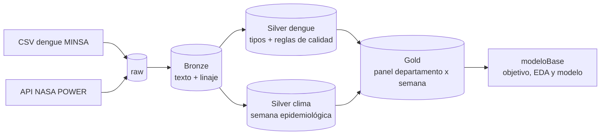

# Universidad Privada Antenor Orrego, periodo 2026-20.
## Ingeniería de Sistemas e Inteligencia Artificial

## Modelo predictivo de brotes de dengue por variables climáticas en el Perú

Proyecto del curso **Big Data y Analítica de Datos**

Pipeline sobre Apache Spark que integra el registro nacional de vigilancia epidemiológica de dengue
del MINSA (CDC Perú, 2000–2024) con series climáticas diarias de NASA POWER, para estimar por
departamento y semana epidemiológica la probabilidad de que ocurra un brote en las 4 semanas siguientes.

> **Proyecto académico:** No es un sistema oficial del MINSA y sus resultados no deben usarse
> para decisiones sanitarias sin validación institucional.

## Equipo

| Integrante | Rol |
|---|---|
| Arenas Arriaga, Johan Michael | Coordinación, análisis y modelado |
| Campos Acevedo, Gianfranco | Ingeniería de datos, calidad y documentación |

Docente: Ing. Armando Javier Caballero Alvarado

## Problema

El MINSA detecta las epidemias de dengue cuando los casos ya superan el canal endémico, es decir,
con **0 semanas de anticipación**. Este proyecto busca anticipar esa alerta para priorizar brigadas
y recursos hacia los departamentos con mayor riesgo.

## Datos

| Fuente | Entidad | Acceso | Periodo | Volumen |
|---|---|---|---|---|
| Vigilancia epidemiológica de dengue | CDC Perú – MINSA | Plataforma Nacional de Datos Abiertos ([COMPLETAR enlace]) | 2000–2024, semanal | 1 029 421 registros, 14 columnas, 103.5 MB (CSV `;`) |
| NASA POWER: `T2M`, `RH2M`, `PRECTOTCORR` | NASA Langley Research Center | API pública, descarga automática desde el notebook | 2000–2024, diario | 19 puntos, 173 508 filas |

**Los datos no se versionan** porque el registro de vigilancia contiene edad, sexo y localidad de
pacientes. Solo se incluye `data/muestra/`, que es el panel final agregado por departamento y semana,
sin datos personales.

## Arquitectura Línea Base



| Capa | Ruta | Contenido | Formato |
|---|---|---|---|
| Raw | `data/raw/` | Archivos originales, nunca se modifican | CSV, JSON |
| Bronze | `data/bronze/` | El dato tal como llegó, todo como texto, con `_archivo_origen` y `_fecha_ingesta` | Parquet |
| Silver | `data/silver/` | Dengue tipado y validado (particionado por `ano`), registros rechazados con su motivo, clima semanal | Parquet |
| Gold | `data/gold/panel_dengue_clima` | Una fila por departamento × semana epidemiológica, incluidas las semanas sin casos | Parquet |

La tabla Gold es el **contrato** entre los dos notebooks: `modeloBase` solo depende de sus columnas
(`cod_dep, departamento, ano, semana, casos, temp_media, hum_media, precip_total`).

## Estructura del repositorio

```
.
├── README.md
├── docker-compose.yml
├── .gitignore
├── notebooks/
│   ├── cargaDatos.ipynb      # raw → Bronze → Silver → Gold, tiempos y escalabilidad
│   └── modeloBase.ipynb      # variable objetivo, análisis exploratorio y modelo base
└── data/                     # no se versiona, salvo data/muestra/
    ├── raw/                  # CSV de dengue (manual) y clima_nasa/ (automático)
    ├── bronze/  silver/  gold/
    ├── metricas/             # tiempos, escalabilidad y métricas del modelo
    ├── figuras/              # figuras del análisis exploratorio
    └── muestra/              # panel Gold agregado (sí se versiona)
```

## Requisitos

- Docker Engine o Docker Desktop con Compose v2
- 8 GB de RAM recomendados (Spark usa 4 GB)
- Unos 3 GB de disco libre; la prueba de escalabilidad ×100 necesita bastante más
- Conexión a internet en la primera ejecución, para descargar el clima de NASA POWER

## Instalación

```bash
git clone https://github.com/[COMPLETAR-usuario]/minsadengue-bigdata.git
cd minsadengue-bigdata
docker compose up -d
docker compose logs pyspark
```

- Jupyter: http://localhost:8888
- Spark UI (mientras haya una sesión activa): http://localhost:4040

## Obtención de los datos

1. **Dengue:** descargar el conjunto de vigilancia epidemiológica de dengue desde https://www.datosabiertos.gob.pe/dataset/vigilancia-epidemiol%C3%B3gica-de-dengue y guardarlo como `data/raw/datos_abiertos_vigilancia_dengue_2000_2024.csv`.
2. **Clima:** no requiere acción. La primera celda de descarga de `cargaDatos.ipynb` consulta la API
   de NASA POWER y guarda las respuestas en `data/raw/clima_nasa/`. Las ejecuciones posteriores
   reutilizan esos archivos y no vuelven a descargar.

## Orden de ejecución

1. `notebooks/cargaDatos.ipynb` → *Restart & Run All* (secciones 0 a 6).
2. `notebooks/cargaDatos.ipynb`, sección 7 (escalabilidad) → opcional y pesada. Borrar
   `data/escalabilidad/` al terminar.
3. `notebooks/modeloBase.ipynb` → *Restart & Run All*.

### Parámetros principales

| Parámetro | Notebook | Valor | Significado |
|---|---|---|---|
| `USAR_CACHE` | cargaDatos | `True` | Activa la caché de Bronze. Correr con `False` y `True` para comparar tiempos |
| `SHUFFLE_PARTITIONS` | cargaDatos | `8` | Particiones de shuffle. El valor por defecto de Spark es 200 |
| `MIN_CASOS_DEPARTAMENTO` | cargaDatos | `1000` | Mínimo de casos en 25 años para que un departamento entre al modelo |
| `FACTORES` | cargaDatos | `[1, 10, 100]` | Réplicas para la prueba de escalabilidad |
| `ANIOS_HISTORIA` | modeloBase | `5` | Años previos usados para el canal endémico |
| `MIN_CASOS_BROTE` | modeloBase | `5` | Mínimo de casos para considerar una semana como brote |
| `HORIZONTE` | modeloBase | `4` | Semanas de anticipación que se predicen |

### Ejecución rápida con la muestra

Sin el CSV de dengue, `modeloBase.ipynb` se puede ejecutar igual: si no encuentra la tabla Gold,
usa `data/muestra/panel_dengue_clima.csv`.

## Decisiones metodológicas principales

- **Semana epidemiológica (domingo a sábado),** calculada con la regla estándar: la semana 1 es la
  que contiene el 4 de enero. Se aplica igual al dengue y al clima.
- **Clima en el foco de dengue,** no en la capital departamental. Cuando la celda de NASA POWER
  mezclaba costa y sierra, se eligió la celda vecina costera o de la misma cuenca.
- **Anomalías climáticas por departamento,** calculadas con años de entrenamiento únicamente.
- **19 departamentos modelados,** que concentran el 99.93 % de los casos.
- **Brote según canal endémico:** casos por encima del cuartil 3 de la misma semana en los 5 años previos.
- **Partición temporal:** entrenamiento 2005–2019, prueba 2021–2024. 2020 se excluye por la caída
  de notificación durante la pandemia.

## Privacidad

- `data/` no se versiona; ningún registro individual llega al repositorio.
- Silver elimina `localidad`, `localcod` y `diresa`.
- Gold y la muestra contienen solo conteos agregados por departamento y semana.
- Marco normativo: Ley N.º 29733, Ley de Protección de Datos Personales del Perú.

## Limitaciones

- Resolución de NASA POWER de unos 50 km. Amazonas y Cajamarca comparten celda, al igual que Lima y Callao.
- Un solo foco climático por departamento. Departamentos con varios focos lejanos (Loreto, Cusco) quedan
  representados de forma parcial.
- Subnotificación y cambios en la vigilancia a lo largo de 25 años.
- No se modela el retraso de notificación.
- Seis departamentos sin transmisión sostenida quedan fuera del modelo predictivo.

## Resultados del modelo base

| Modelo | AUC-ROC | AUC-PR | Precisión | Recall |
|---|---|---|---|---|
| Persistencia | | | | |
| Logística: solo casos | | | | |
| Logística: casos + clima (línea base) |  | | | |

Fuente: `data/metricas/modelo_base.csv`.

## Fuentes y créditos

- Datos climáticos obtenidos del proyecto POWER del NASA Langley Research Center, financiado por el
  programa NASA Earth Science / Applied Science.
- Datos de vigilancia epidemiológica: Centro Nacional de Epidemiología, Prevención y Control de
  Enfermedades (CDC Perú), Ministerio de Salud.

## Uso de inteligencia artificial generativa

Declarado en el Anexo A del informe del proyecto.

## Licencia